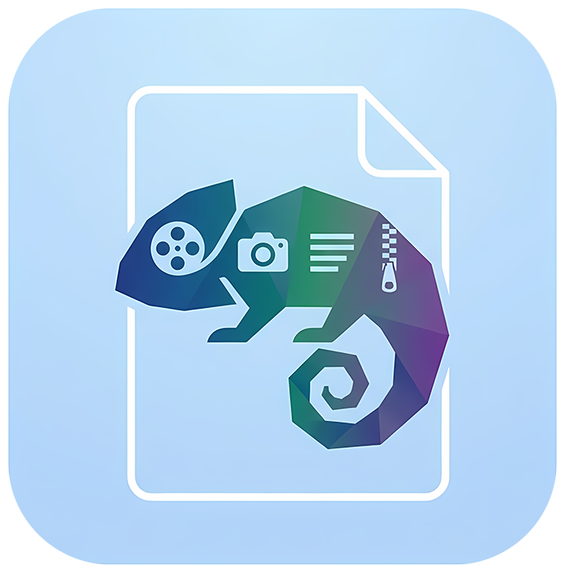

<div align="center">



# Polyglot Studio

**Zero-Dependency Multi-Format Media Polyglot Generator & Binary Inspector**

[](https://flutter.dev)
[](https://dart.dev)
[](#-platform-support)
[](LICENSE)

*Package Identifier:* `dev.hazhan.polyglot`

</div>

---

## 🦎 What is Polyglot Studio?

**Polyglot Studio** is a cross-platform desktop, mobile, and web application that synthesizes **true
multi-format media polyglots** in memory.

A **polyglot file** is a single, valid binary file that simultaneously satisfies the file format
specifications of completely different file types. When you change the file extension, it
dynamically changes its behavior to match the native application opening it:

```
                          ┌──────────────────────────┐
                          │    polyglot.ico.mp4...   │
                          └─────────────┬────────────┘
                                        │
        ┌──────────────┬────────────────┼────────────────┬──────────────┐
        ▼              ▼                ▼                ▼              ▼
   Rename to:     Rename to:       Rename to:       Rename to:     Rename to:
     .mp4            .ico             .html            .pdf           .zip
        │              │                │                │              │
        ▼              ▼                ▼                ▼              ▼
  [VLC Player]   [Photo Viewer]     [Chrome/Edge]     [Acrobat]     [7-Zip/WinRAR]
  Plays Video     Renders PNG      Renders Webpage    Opens PDF      Extracts ZIP
```

---

## 📸 Screenshots

### 🖥️ Desktop View

|                             Polyglot Studio Workbench                              |                             Binary & Payload Inspector                             |
|:----------------------------------------------------------------------------------:|:----------------------------------------------------------------------------------:|
|  |  |

### 📱 Mobile View

|                              Mobile Studio Workbench                              |                              Mobile Binary Inspector                              |
|:---------------------------------------------------------------------------------:|:---------------------------------------------------------------------------------:|
|  |  |

---

## ✨ Features

### ⚡ 1. Polyglot Studio (Workbench & Generator)

- **Zero External CLI Dependencies**: Replaces `imagemagick`, `mp4edit`, `zip`, `unzip`, and `cat`
  with pure in-memory Dart byte manipulation.
- **In-Memory Synthesis**: Fast assembly entirely in RAM before saving to disk.
- **Core Base Media**: Packs any image (normalized to 32bpp PNG) and ISO Base Media video/audio
  container (`mp4`, `m4a`, `mov`).
- **Polyglot Payloads**: Embeds PDF documents, HTML webpages (with CSS font-suppression to silence
  binary noise), merged ZIP archives (`.zip`, `.apk`, `.docx`, `.xlsx`, `.pptx`), and arbitrary
  appendable binaries (`.bin`, `.sqlite`, AI weights).
- **Header Dead Space Editor**: Safely writes custom signatures, metadata watermarks, or shell
  shebangs (`#!/bin/sh`) into bytes 22..240 without corrupting video atoms (strictly capped at 200
  bytes).
- **Timestamped Filenames**: Outputs filesystem-safe files with precise date-and-time timestamps (
  e.g. `polyglot_20260813_195952.ico.mp4.html.pdf.zip`).
- **Interactive Atom Map**: Segmented visualizer displaying exact atom byte offsets (`[0..288]`,
  `[skip]`, `[moov]`, `[mdat]`, `[pdf]`, `[zip]`).
- **Chameleon Format Simulator**: Interactive chip switcher showing how the file manifests across
  native applications.

### 🔍 2. Binary Header & Payload Inspector

- **Drag-and-Drop File Inspection**: Drop any existing polyglot or binary file to analyze its
  internal layout.
- **Dead Space String Extractor**: Automatically decodes bytes 22..240 and reveals embedded magic
  strings or metadata.
- **Appendable Payload Viewer & Extractor**: Detects raw appended data streams, displays their start
  offset and size, shows formatted text/JSON previews, and provides a 1-click **"Extract Payload to
  Disk"** action.
- **Interactive 256-Byte Hex Dump**: Expandable, horizontally scrollable hex and ASCII view.

---

## 🎯 Supported Formats

| Extension                       | Behavior When Opened       | Technical Mechanism                                                                              |
|:--------------------------------|:---------------------------|:-------------------------------------------------------------------------------------------------|
| **`.mp4`**                      | **Plays video / audio**    | Dual-purpose box acts as valid `ftyp` atom; `stco`/`co64` chunk tables shifted by payload delta. |
| **`.ico` / `.png`**             | **Displays 32bpp image**   | Byte 0 is ICO header (`0x0000 0x0001`); directory pointer jumps to PNG in the `skip` atom.       |
| **`.html`**                     | **Renders webpage**        | `<style>body{font-size:0}</style>` suppresses binary junk while rendering your custom HTML.      |
| **`.pdf`**                      | **Opens PDF document**     | `%PDF-1.4` stream object encapsulates the MP4 stream; shifted `xref` table resolves page trees.  |
| **`.zip`**                      | **Extracts archive files** | ZIP extractors read backward from EOF to locate the shifted Central Directory (`PK\x05\x06`).    |
| **`.docx` / `.xlsx` / `.pptx`** | **Opens in MS Office**     | Standard OpenXML ZIP package structure preserved.                                                |
| **`.apk` / `.jar`**             | **Installs / Runs app**    | Android package / Java archive structures extracted via Central Directory offsets.               |
| **`.bin`**                      | **Custom binary payload**  | Machine learning models, SQLite databases, or encrypted vaults preserved before ZIP tail.        |

---

## 📐 Binary Architecture

```
Byte Offset:
0       4            22                         240      256      288
┌───────┬────────────┬──────────────────────────┬────────┬────────┬───────────────────┐
│ ICO   │ ICO Dir    │ Header Extra Dead Space  │ Compat │ 2nd    │ skip Atom         │
│ Magic │ Width/Hgt  │ (ASCII / Magic / PDF)    │ Brands │ ftyp   │ (HTML + 32bpp PNG)│
└───────┴────────────┴──────────────────────────┴────────┴────────┴───────────────────┘
                                                                           │
┌──────────────────────────────────────────────────────────────────────────┘
▼
[ MP4 Containers (moov + mdat) with shifted stco/co64 chunk tables ]
│
▼
[ Encapsulated PDF Stream Object + Shifted xref Cross-Reference Table ]
│
▼
[ Appendable Binaries (TFLite weights, SQLite DBs, Encrypted Vaults) ]
│
▼
[ Merged ZIP Central Directory + End of Central Directory (EOCD) Record at EOF ]
```

---

## 🚀 Getting Started

### Prerequisites

- [Flutter SDK](https://flutter.dev/docs/get-started/install) (version 3.0.0 or higher)
- [Dart SDK](https://dart.dev/get-dart) (included with Flutter)

### Installation & Run

1. **Clone the repository**:
   ```bash
   git clone https://github.com/your-username/polyglot_studio.git
   cd polyglot_studio
   ```

2. **Install dependencies**:
   ```bash
   flutter pub get
   ```

3. **Run on your platform**:
   ```bash
   # Windows Desktop
   flutter run -d windows

   # macOS Desktop
   flutter run -d macos

   # Linux Desktop
   flutter run -d linux

   # Web Browser
   flutter run -d chrome

   # Android Device / Emulator
   flutter run -d android
   ```

---

## 💻 Headless CLI Generator (Pure Dart)

Polyglot Studio includes a dedicated headless command-line generator powered by [
`packages/polyglot_core`](packages/polyglot_core). It is 100% pure Dart with zero Flutter or
graphical dependencies, allowing you to synthesize polyglots directly in scripts, CI/CD pipelines,
or server environments without launching the GUI.

### 1. Run directly with Dart

```bash
dart run packages/polyglot_core/bin/beheader.dart <output> <image> <video|audio> [options] [appendable...]
```

#### Arguments & Options:

* `output`: Destination path for the resulting polyglot file (e.g. `output.ico.mp4.pdf.zip`).
* `image`: Input image file (`.png`, `.jpg`, `.webp`, etc. — automatically normalized to 32bpp PNG).
* `video|audio`: Input ISO-BMFF container (`.mp4`, `.m4a`, `.mov`, etc.).
* `-h, --html <file>`: Embed custom HTML document with CSS binary junk suppression.
* `-p, --pdf <file>`: Encapsulate PDF stream object and xref table.
* `-z, --zip <file>`: Merge ZIP-like archive (repeatable flag: `.zip`, `.apk`, `.jar`, `.docx`,
  `.xlsx`, `.pptx`).
* `-e, --extra <file>`: Embed small (<200 bytes) text, metadata, or shebang in header dead space.
* `[appendable...]`: Raw binary payload(s) appended before the ZIP tail (`.bin`, `.sqlite`, AI
  weights).

#### Example:

```bash
dart run packages/polyglot_core/bin/beheader.dart \
  output_polyglot.bin \
  assets/logo/logo_small.png \
  sample_video.mp4 \
  --pdf sample_doc.pdf \
  --html page.html \
  --zip archive.zip
```

### 2. Compile to Standalone Native Executable

You can compile the CLI tool into a single, self-contained native binary (`.exe` on Windows or
native executable on macOS/Linux):

```bash
# Windows
dart compile exe packages/polyglot_core/bin/beheader.dart -o beheader.exe

# macOS / Linux
dart compile exe packages/polyglot_core/bin/beheader.dart -o beheader
```

Run the compiled executable directly:

```bash
./beheader final_polyglot.bin cover.png video.mp4 --pdf document.pdf --zip data.zip
```

---

## 🧪 Testing & Verification

Polyglot Studio includes automated test suites covering widget rendering, mobile responsiveness, and
binary engine operations:

```bash
# Run app widget tests
flutter test

# Run core binary engine unit tests
cd packages/polyglot_core
dart test
```

---

## 📱 Platform Support

| Platform    | Target Status | Features                                                              |
|:------------|:-------------:|:----------------------------------------------------------------------|
| **Windows** |  ✅ Supported  | Native desktop studio layout, file associations, drag-and-drop.       |
| **macOS**   |  ✅ Supported  | Native desktop studio layout, drag-and-drop, AppKit file dialogs.     |
| **Linux**   |  ✅ Supported  | Native GTK studio layout, drag-and-drop, portal file pickers.         |
| **Android** |  ✅ Supported  | Mobile touch layout, glassmorphic command deck, collapsible payloads. |
| **iOS**     |  ✅ Supported  | Mobile touch layout, document pickers, share sheet export.            |
| **Web**     |  ✅ Supported  | In-browser RAM synthesis, file drop targets, client-side downloads.   |

---

## 🙏 Acknowledgements & Credits

The core binary polyglot synthesis concepts, atom arrangements, and techniques in this project are
based on the original **[beheader](https://github.com/p2r3/beheader)** tool by *
*[p2r3](https://github.com/p2r3)**.
